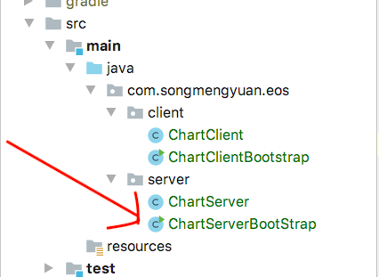
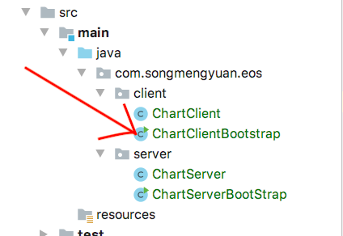
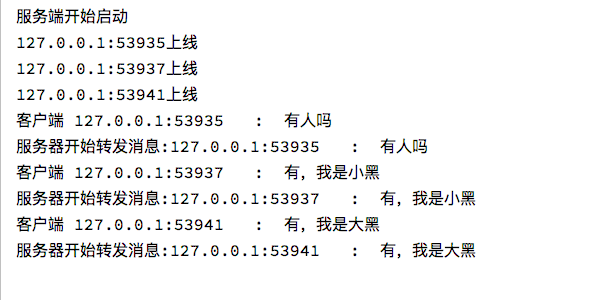
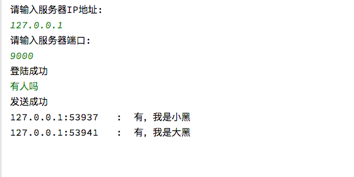
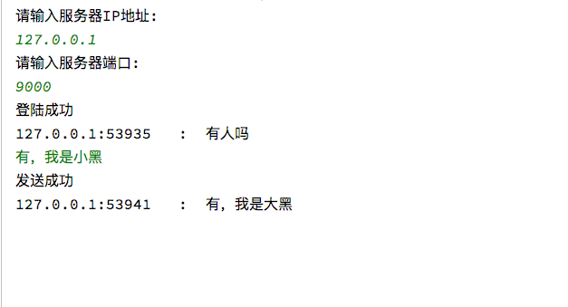
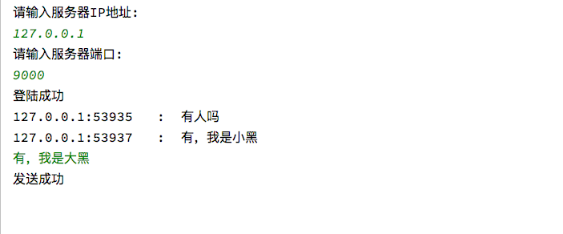

# What is Eos-nio?

a light weight NIO communication tool

# How to start

## Preface

* This project is built on `Gradle`,so you must install `Gradle` to install dependence.

  * **Linux/Mac OS** 

    ```shell
    ./gradlew build
    ```

    

  * **Windows**
  
    ```shell
    gradlew.bat build
    ```

## Server Node

Run `ChartServerBootStrap.java`




## Client Node

Run `ChartClientBootStrap.java`



You can run client node more than one

# View

## Server Node



## Client Node

* Client1



* Client2

  ​	

* Client3

  ​	

